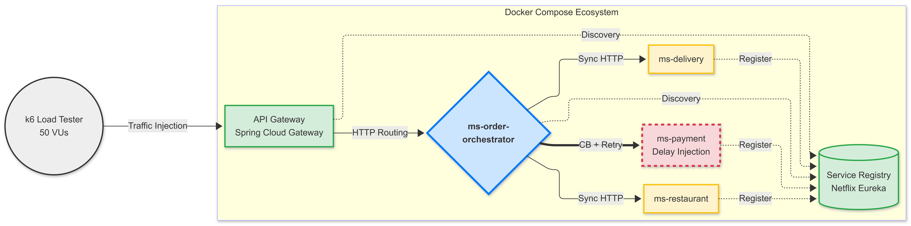

# 🛡️ Resilience in Microservices: A Quantitative Analysis of Circuit Breaker and Retry Patterns

> This repository contains the experimental environment and source code for an undergraduate thesis developed at the Faculty of Computing (FACOM), Federal University of Uberlândia (UFU). The research investigates the impact of resilience patterns on mitigating cascading failures within distributed systems.

## 📝 Abstract
Modern software development has shifted toward microservices to achieve scalability and independence. However, this distribution introduces vulnerabilities such as cascading failures. This project **evaluates the efficacy of the Circuit Breaker and Retry patterns** using a quantitative experimental approach. By leveraging Resilience4j and **k6 load testing, we demonstrate how **hybrid resilience strategies prevent resource exhaustion and maintain system availability under stress**.

## 🏗️ System Architecture
The platform simulates a distributed food delivery workflow where a single transaction triggers a chain of synchronous operations across multiple specialized services. This architecture acts as a controlled testbed to evaluate the "cascading failure" phenomenon—a scenario where a localized delay in a secondary service can lead to global resource exhaustion in the orchestrator.

To ensure a robust and scalable environment, the system is organized into three distinct layers:

- **Infrastructure Layer:** Utilizes **Spring Cloud Gateway** for centralized request routing and **Netflix Eureka** for **dynamic service discovery**, ensuring that the orchestrator can locate domain services without static IP coupling.
- **Orchestration Layer:** Centered on the `ms-order-orchestrator`, which manages the order lifecycle. This component integrates Resilience4j to implement the **Circuit Breaker** and **Retry** patterns, serving as the primary defense against network instability.
- **Domain Layer:** Consists of independent microservices — `ms-payment`, `ms-restaurant`, and `ms-delivery` — that handle specific business logic. In the experiment, the payment service is the target of **systematic fault injection (artificial latency)** to stress-test the system's resilience.

  

## 🧪 Methodology & Fault Injection
To validate the hypothesis, a systematic fault injection protocol was employed:

1. **Baseline Scenario:** Establishing performance metrics under normal conditions.
2. **Latency Injection:** Introducing a 3-second artificial delay (Thread.sleep) in the payment service to simulate downstream degradation.
3. **Stress Testing:** Utilizing k6 to inject 50 simultaneous Virtual Users (VUs) to induce thread exhaustion.

## 🛠️ Tech Stack

- **Language:** Java 17
- **Framework:** Spring Boot 3.x
- **Resilience:** Resilience4j
- **Environment:** Docker & Docker Compose
- **Testing:** k6
